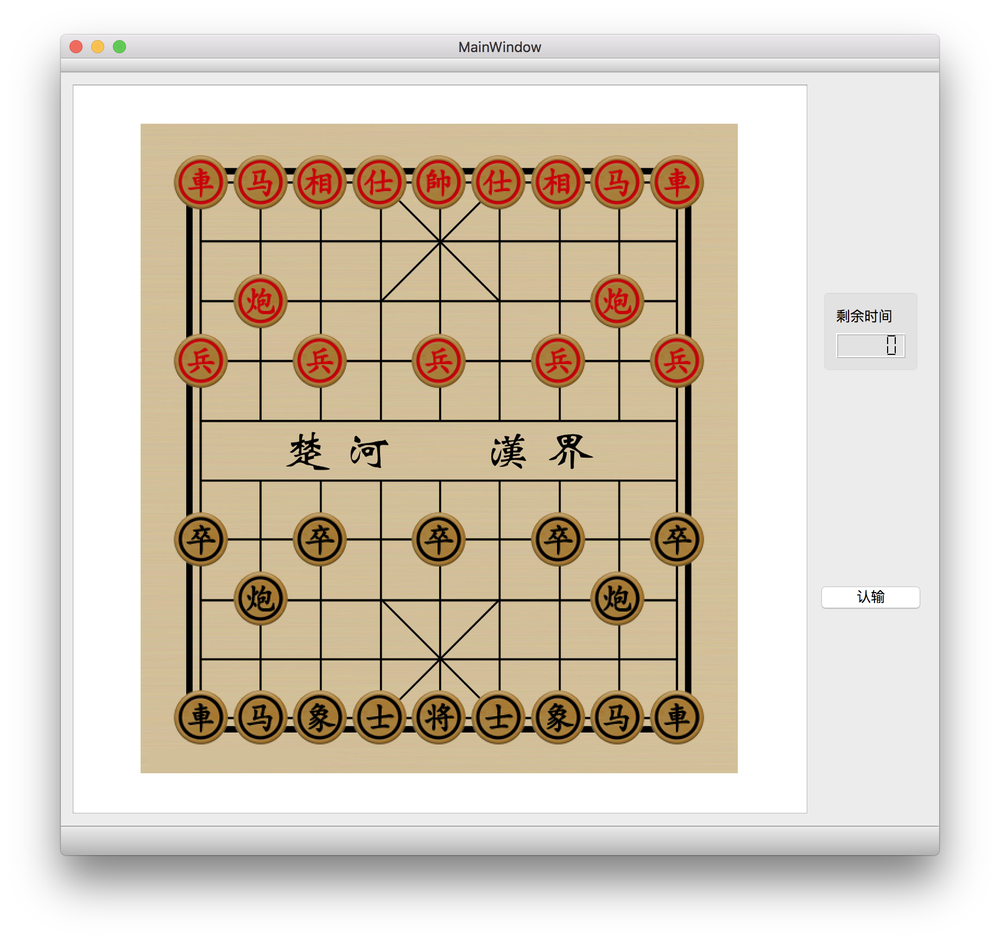

# ChineseChess 中国象棋 XiangQi

此为中国象棋联机对战软件，采用qt编写。网络采取c2c模式。

目前在retina macbook pro 15 inch、高分屏windows与普通屏windows上进行过测试。

针对macbook和普通屏windows，编译时gamecenter.h里的`#define LOW_DPI`要保留，对于高分屏windows，要注释掉`#define LOW_DPI`

更多信息请参考`doc/manual.md`

